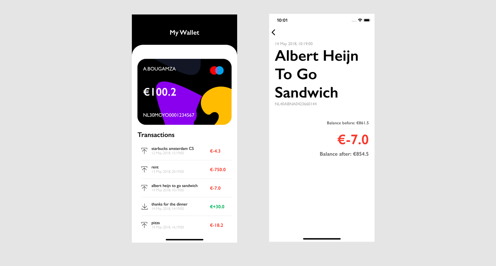
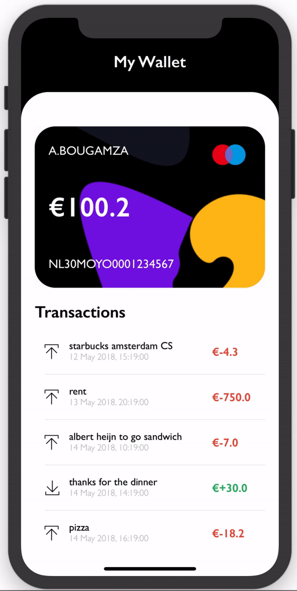

  

This is My Wallet app and it is inspired from the design of Victa Wille on dribbble: https://dribbble.com/shots/6784316-Banking-app

# Main account
`My Wallet` reads transactions from a stored json and shows a an account with its transactions.

# Demo App

  

